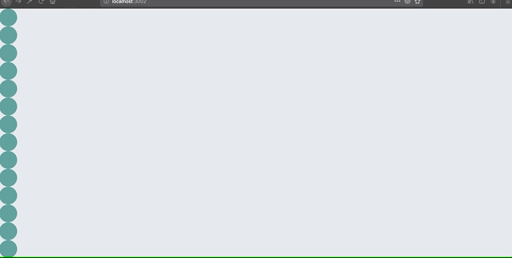

# React-GSAP-animation
Create a small application to get familiar with Gsap animaion library

- Build using --
  - Reactjs Hooks
  - Redux with Hooks
  - GSAP for animation

## Scripts

| Script          | Description                                     |
| --------------- | ----------------------------------------------- |
| `npm install`   | Installs all dependencies                       |
| `npm start`     | Starts project in `development` environment     |
| `npm run build` | Builds the project for `production` environment |

This project was bootstrapped with [Create React App](https://github.com/facebook/create-react-app).

